## **一、核心结论（先讲结论）**

1. **你现在的错误本质：**\
   WPS 的 `MofficeFileProvider` 没有导出（`exported=false`），而且 **只给了读权限，没给写权限**，所以你在 `WpsAccessibilityService` 里用 `ParcelFileDescriptor` 去 `openFileDescriptor(..., "wa")` 写时，系统直接抛 `SecurityException`。**github.io**
2. **“返回列表页后再写 URI”这条路本身就不现实：**
   - 通过 `ACTION_VIEW` / “用其他应用打开”传来的 Content URI，**读写权限只属于接收它的那个 Activity，而且会在 Activity 结束时撤销**。**microsoft.com+1**
   - 你在无障碍服务里再去访问这个 URI，**要么权限已经没了，要么本身就只读**。
3. **正确做法：**\
   不要等到“返回列表页”再写原来的 Content URI。\
   要**在“有权限的瞬间”（Activity 启动时）就把文件内容复制到自己私有目录**，后面所有操作都在自己的文件副本上进行，再让 WPS 打开你的副本。

<br />

## **二、整体流程（完整方案概览）**

先给你一个整体流程图，把“读 / 写 / 权限 / 复制”全串起来：

flowchart LR
A\[WPS 文件列表 → 用其他应用打开] --> B\[插件 Activity 启动Intent 中拿到 Content URI]

```mermaid
flowchart LR
    A[WPS 文件列表 → 用其他应用打开] --> B[插件 Activity 启动<br/>Intent 中拿到 Content URI]

    B --> C[权限窗口期<br/>临时读权限]
    C --> D[立即读取密码<br/>ContentResolver.openInputStream]
    D --> E[立即复制文件到私有目录<br/>cacheDir/filesDir]

    E --> F[保存信息<br/>私有文件路径 + 密码 → 服务/DB]
    F --> G[结束 Activity 或切回 WPS]

    G --> H[用户在 WPS 中操作文档<br/>修改/保存密码]
    H --> I[无障碍服务监听返回列表页]
    I --> J[触发写入时机<br/>但只操作私有文件副本]

    J --> K[在副本上写入 ZIP Extra Field 密码]
    K --> L[下次打开时<br/>WPS 打开更新后的副本]
```



**核心原则：**

- **一切“写文件”动作都在你自己私有目录的副本上做。**
- **WPS 只负责“打开你的副本”，不再碰原始 Content URI。**

## **三、具体技术方案（分模块）**

### **1. 模块1：启动时立刻读取 + 复制文件（在 Activity 中）**

**目标：**\
在 `ProxyActivity` / 处理 Intent 的 Activity 中，利用系统授予的**临时读权限**，做两件事：

1. 从 Content URI 读取 ZIP Extra Field 里的密码；
2. 把整个文件内容复制到应用私有目录（`cacheDir` 或 `filesDir`）。

#### **1.1 从 Content URI 读取密码（你已经有）**

参考文档中的“直接流读取”：

```Kotlin
// 在 Activity 中
val uri: Uri = intent.data ?: return  // content://...

val resolver = contentResolver
val inputStream = resolver.openInputStream(uri)
    ?: throw FileNotFoundException("无法打开 URI: $uri")

// 在 ZipExtraFieldManager 中从流尾部读取 WPS 密码签名 & 解密
val password = ZipExtraFieldManager.readPasswordFromStream(inputStream)

```

> 注意：\
> 这一步**只读不写**，只要 WPS 给了读权限，就能成功。你现在的问题是在写的那一步。

#### **1.2 复制文件到私有目录（关键步骤）**

**在同一个 Activity 里，立刻复制：**

```Kotlin
fun copyContentUriToPrivateCache(context: Context, uri: Uri): File {
    // 1. 创建私有文件
    val fileName = "wps_${System.currentTimeMillis()}.docx"
    val privateFile = File(context.cacheDir, fileName)

    // 2. 通过 ContentResolver 把 URI 内容复制到私有文件
    context.contentResolver.openInputStream(uri)?.use { input ->
        privateFile.outputStream().use { output ->
            input.copyTo(output)
        }
    } ?: throw FileNotFoundException("无法打开 URI: $uri")

    return privateFile
}

```

**要点：**

- 这一步是在 **Activity 还活着、URI 权限还在** 的时候执行；
- 复制完以后，这个私有文件**完全属于你自己应用**，不需要任何额外权限。

#### **1.3 保存必要信息给后续服务**

把下面信息保存起来（内存 / SharedPreferences / Room 都可以）：

- `privateFilePath`：私有文件路径；
- `password`：刚读出来的密码；
- `originalUri`：原始 Content URI（仅用于日志/标识，后面不再用它做写操作）。

示例：

```Kotlin
data class PasswordSession(
    val id: String,
    val privateFilePath: String,
    val password: String,
    val originalUri: Uri,
    val createdAt: Long = System.currentTimeMillis()
)

// 在 Activity 中
val session = PasswordSession(
    id = UUID.randomUUID().toString(),
    privateFilePath = privateFile.absolutePath,
    password = password,
    originalUri = uri
)

// 交给单例管理器或服务
PasswordSessionManager.currentSession = session

```

### **2. 模块2：WPS 打开“你的副本”，而不是原始 URI**

**这一步非常关键，是你“绕开权限和锁”的核心。**

#### **2.1 通过 FileProvider 暴露私有文件**

1. 在清单里配置 FileProvider（authority 换成你自己的）：

```XML
<provider
    android:name="androidx.core.content.FileProvider"
    android:authorities="com.wpspasswordmanager.fileprovider"
    android:exported="false"
    android:grantUriPermissions="true">
    <meta-data
        android:name="android.support.FILE_PROVIDER_PATHS"
        android:resource="@xml/file_paths" />
</provider>

```

1. `res/xml/file_paths.xml`：

```XML
<paths>
    <cache-path name="wps_cache" path="." />
</paths>

```

1. 在 Activity 中，构造 FileProvider URI：

```Kotlin
fun getShareableUriFromFile(context: Context, file: File): Uri {
    return FileProvider.getUriForFile(
        context,
        "com.wpspasswordmanager.fileprovider", // authority
        file
    )
}

```

#### **2.2 启动 WPS 打开你的副本**

在复制完私有文件之后，立刻：

```Kotlin
val shareUri = getShareableUriFromFile(this, privateFile)

val intent = Intent(Intent.ACTION_VIEW).apply {
    setDataAndType(shareUri, "application/vnd.openxmlformats-officedocument.wordprocessingml.document")
    addFlags(Intent.FLAG_GRANT_READ_URI_PERMISSION)
    // 如果你希望 WPS 也能写，可以同时给写权限（但注意：WPS 可能会覆盖你的副本）
    // addFlags(Intent.FLAG_GRANT_WRITE_URI_PERMISSION)
}

startActivity(intent)

```

**结果：**

- WPS 打开的是 **你私有目录下的副本**；
- WPS 拥有对这个副本的读写权限（如果你给了 `FLAG_GRANT_WRITE_URI_PERMISSION`）；
- 你自己应用对这个文件拥有完全访问权（因为它就在你的沙箱里）。

### **3. 模块3：无障碍服务只操作“私有副本”**

#### **3.1 写密码时机：监听“返回列表页”**

你已经在 `WpsAccessibilityService` 里监听窗口状态，这里可以保持不变：

- 当检测到 WPS 返回到“文件列表页”时，触发写入；
- **但写入的对象从 `originalUri` 变为 `privateFile`。**

```Kotlin
// WpsAccessibilityService 中
fun onWindowStateChanged(event: AccessibilityEvent) {
    if (isWpsFileListScreen(event)) {
        val session = PasswordSessionManager.currentSession ?: return
        val privateFile = File(session.privateFilePath)

        // 在这里写密码到私有文件副本
        ZipExtraFieldManager.writePasswordToFile(
            file = privateFile,
            newPassword = session.password
        )
    }
}

```

#### **3.2 写密码到私有文件（不再用 Content URI）**

`ZipExtraFieldManager` 中新增一个“写本地文件”的方法：

```Kotlin
fun writePasswordToFile(file: File, newPassword: String) {
    // 使用 RandomAccessFile 或 ParcelFileDescriptor 从文件尾部写入 ZIP Extra Field
    RandomAccessFile(file, "rw").use { raf ->
        // 1. 定位到文件尾部
        raf.seek(raf.length())
        // 2. 写入你的 WPS 密码签名 + 加密后的密码数据
        // 这部分是你文档里“ZIP Extra Field 存储”的具体实现
        // ...
    }
}

```

**优点：**

- 完全绕开 Content URI 权限问题；
- 不受 WPS 文件锁限制（WPS 已经打开的是你的副本，但它不会锁死你自己的访问，你自己用 RandomAccessFile 完全可以写）。

### **4. 模块4：用户下次打开时，继续使用你的副本**

流程变成：

1. 用户下次再从 WPS 文件列表点“用其他应用打开” → 选你的应用；
2. 你的 `ProxyActivity` 启动，收到 Content URI；
3. 你再次：
   - 读密码；
   - **判断是否已经有私有副本**（例如按某种 ID 或路径映射）；
   - 如果有，直接使用旧副本（或按需更新）。

这样用户实际操作的是“你维护的副本”，**原始 Content URI 只是一个“入口标识”**，你不再依赖它做任何写操作。

## **四、回答你最关心的两个问题**

### **Q1：返回 WPS 列表页后，我还有 Content URI 读写权限吗？**

**结论：没有 / 不稳定 / 不应该依赖。**

- 通过 `FLAG_GRANT_READ_URI_PERMISSION` / `FLAG_GRANT_WRITE_URI_PERMISSION` 授予的权限，**只绑定到接收它的 Activity，且在 Activity 结束时撤销**。**microsoft.com+1**
- 你的无障碍服务是在另一个组件，**不是那个 Activity**，因此：
  - 要么权限已经撤销；
  - 要么 WPS 的 FileProvider 根本没导出，导致你无法直接写。

所以：

> **你必须在 Activity 还活着、还有权限的时候，把“以后要写的东西”全部准备好（至少要有自己的副本）。**

### **Q2：那复制和回写要怎么做？**

用上面的方案，一句话总结：

> **复制：在 Activity 启动时，用 Content URI 的读权限复制到私有目录；\
> 回写：在无障碍服务里，只写你自己私有目录里的文件副本。**

**不再依赖“返回列表页后去访问原始 Content URI”。**

## **五、落地步骤建议（你可以按这个顺序改）**

1. **保留现有“读密码”逻辑**
   - 在 Activity 中用 `ContentResolver.openInputStream(uri)` 读取 ZIP Extra Field 密码；
   - 这部分你现在应该是正常的。
2. **新增“复制到私有目录”逻辑**
   - 在同一个 Activity 中，复制文件到 `cacheDir` / `filesDir`；
   - 保存 `privateFilePath` + `password` 给服务用。
3. **新增“让 WPS 打开副本”的逻辑**
   - 通过 FileProvider 把私有文件共享出去；
   - 用 `ACTION_VIEW` + `FLAG_GRANT_READ_URI_PERMISSION` 启动 WPS。
4. **修改无障碍服务写入逻辑**
   - 不再调用 `writePasswordToContentUri(originalUri)`；
   - 改为 `writePasswordToFile(privateFile)`。
5. **后续优化：会话管理**
   - 增加一个 `PasswordSession` 管理器，用 UUID 或 URI 映射“会话 → 私有文件路径 + 密码”；
   - 用户多次打开同一文件时，可以复用已有副本。

