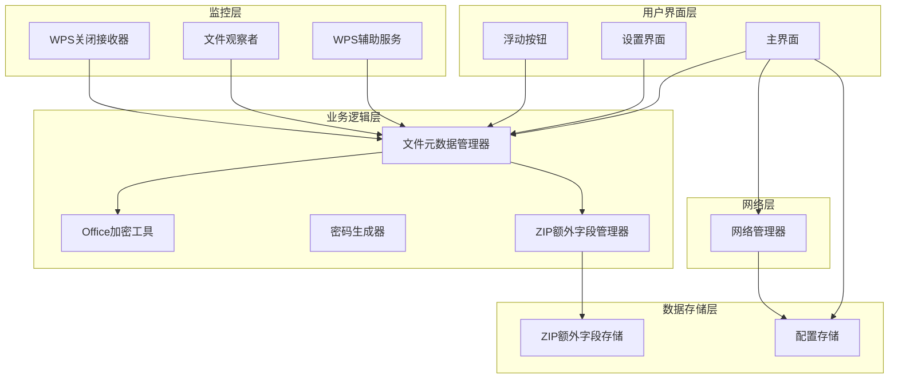
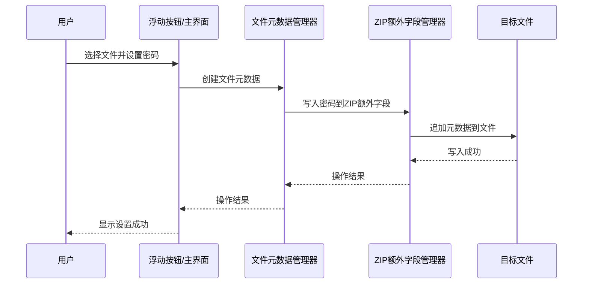
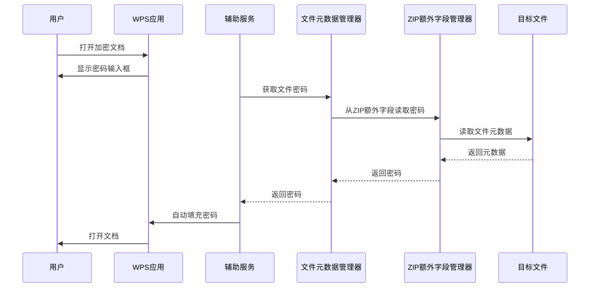
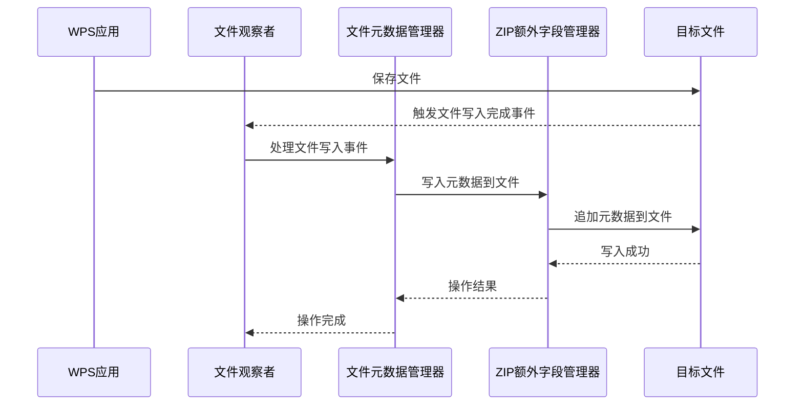
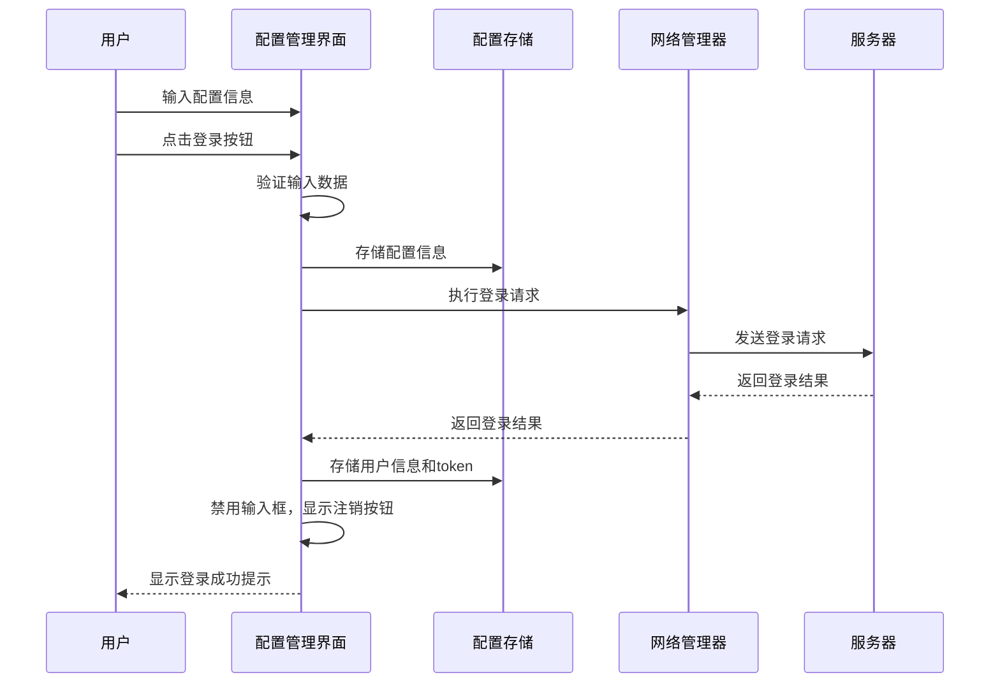
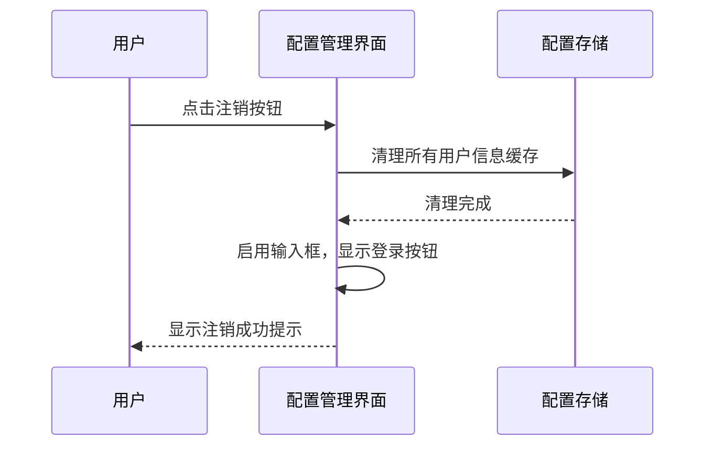

# WPS密码管理器项目文档

## 1. 项目概述

### 1.1 项目背景
随着企业和个人对文档安全需求的不断提高，Office文档的密码保护变得越来越重要。然而，手动管理大量文档的密码不仅繁琐，而且容易遗忘。本项目旨在为WPS Office用户提供一个便捷的文档密码管理解决方案，实现密码的自动存储和验证，提高文档安全性和用户体验。

### 1.2 项目目标
- 为WPS Office文档提供密码管理功能
- 实现密码的自动存储和验证
- 提高用户对文档安全性的控制
- 提供简洁直观的用户界面
- 确保密码存储的安全性

### 1.3 主要功能
- 文档密码设置与验证
- 密码自动存储与管理
- 文档加密状态检测
- 浮动按钮快速操作
- 辅助服务监控WPS操作
- 密码生成功能
- 配置管理与登录功能
- 本地缓存管理
- 外部请求架构

## 2. 技术架构

### 2.1 系统架构图



### 2.2 核心技术栈
- **开发语言**：Kotlin
- **开发平台**：Android
- **核心库**：
  - Apache POI（用于处理Office文件加密）
  - Android AccessibilityService（用于监控WPS操作）
  - Android FileObserver（用于监控文件变化）
  - Gson（用于JSON序列化和反序列化）
  - OkHttp3（用于网络请求）

### 2.3 第三方依赖
| 依赖项 | 版本 | 用途 |
|-------|------|------|
| Apache POI | 5.2.3 | 处理Office文件加密和密码验证 |
| AndroidX | 1.0.0+ | Android支持库 |
| Kotlin | 1.6.0+ | 开发语言 |
| Gson | 2.10.1 | JSON序列化和反序列化 |
| OkHttp3 | 4.10.0 | 网络请求处理 |

## 3. 模块划分

### 3.1 业务逻辑模块

#### 3.1.1 文件元数据管理模块
- **FileMeta.kt**：定义文件元数据结构，包含文件路径、UID和密码信息
- **FileMetaFactory.kt**：文件元数据工厂，负责创建和管理文件元数据
- **FileMetaManager.kt**：文件元数据管理器，负责从文件读取和写入元数据
- **FileMetaHolder.kt**：文件元数据持有者，用于临时存储文件元数据

#### 3.1.2 加密工具模块
- **OfficeEncryptUtils.kt**：Office文件加密工具，负责验证密码和检测文件加密状态
- **PasswordGenerator.kt**：密码生成器，用于生成安全的随机密码

#### 3.1.3 ZIP额外字段管理模块
- **ZipExtraFieldManager.kt**：ZIP额外字段管理器，负责在文件的ZIP额外字段中存储和读取密码信息

### 3.2 监控模块

#### 3.2.1 辅助服务模块
- **AccessibilityServiceManager.kt**：辅助服务管理器，负责管理辅助服务的启动和停止
- **WpsAccessibilityService.kt**：WPS辅助服务，用于监控WPS应用的操作
- **MetadataWriteService.kt**：元数据写入服务，用于后台写入文件元数据

#### 3.2.2 文件监控模块
- **WpsPasswordManagerApplication**：应用主类，包含文件观察者逻辑，用于监控文件变化
- **WpsCloseReceiver.kt**：WPS关闭接收器，用于监听WPS应用的关闭事件

### 3.3 用户界面模块

#### 3.3.1 主界面模块
- **MainActivity.kt**：主活动，提供用户交互界面，包括配置管理和登录功能
- **SettingsActivity.kt**：设置活动，提供应用设置选项

#### 3.3.2 浮动按钮模块
- **FloatingButtonService.kt**：浮动按钮服务，提供快捷操作按钮

#### 3.3.3 通知模块
- **NotificationManager.kt**：通知管理器，用于显示应用通知

#### 3.3.4 代理活动模块
- **ProxyActivity.kt**：代理活动，用于处理特殊的启动场景

### 3.4 存储模块
- **ConfigStorage.kt**：配置存储管理，负责本地缓存的读写操作

### 3.5 网络模块
- **NetworkManager.kt**：网络管理器，负责处理外部请求和基础URL构建

## 4. 业务流程

### 4.1 密码设置流程



### 4.2 密码验证流程



### 4.3 文件监控流程



### 4.4 登录流程



### 4.5 注销流程



## 5. 开发环境配置指南

### 5.1 开发工具
- Android Studio Arctic Fox (2020.3.1) 或更高版本
- JDK 11 或更高版本
- Kotlin 1.6.0 或更高版本

### 5.2 环境配置
1. **克隆项目**：
   ```bash
   git clone <项目仓库地址>
   cd wps-password-app
   ```

2. **配置Gradle**：
   - 打开项目后，Android Studio会自动下载依赖
   - 确保`build.gradle`文件中的依赖配置正确

3. **权限配置**：
   - 应用需要以下权限：
     - `android.permission.FOREGROUND_SERVICE`：前台服务权限
     - `android.permission.SYSTEM_ALERT_WINDOW`：显示浮动窗口权限
     - `android.permission.READ_EXTERNAL_STORAGE`：读取外部存储权限
     - `android.permission.WRITE_EXTERNAL_STORAGE`：写入外部存储权限
     - `android.permission.BIND_ACCESSIBILITY_SERVICE`：绑定辅助服务权限

4. **运行配置**：
   - 在Android Studio中，选择合适的设备或模拟器
   - 点击运行按钮启动应用

## 6. 代码规范与最佳实践

### 6.1 代码规范
- **命名规范**：
  - 类名：使用大驼峰命名法（如`FileMetaManager`）
  - 方法名：使用小驼峰命名法（如`readPasswordFromFile`）
  - 变量名：使用小驼峰命名法（如`filePath`）
  - 常量名：使用全大写加下划线（如`DEFAULT_DEBOUNCE_DELAY`）

- **代码风格**：
  - 缩进：使用4个空格
  - 行宽：不超过120个字符
  - 空行：在逻辑块之间使用空行
  - 注释：为关键方法和复杂逻辑添加注释

### 6.2 最佳实践
- **异常处理**：
  - 对所有可能的异常进行捕获和处理
  - 避免使用空异常捕获
  - 记录异常信息便于调试

- **内存管理**：
  - 使用`use`函数自动关闭流资源
  - 避免内存泄漏，特别是在服务和监听器中

- **性能优化**：
  - 使用防抖处理避免频繁的文件操作
  - 优化文件读写操作，减少I/O开销
  - 使用单例模式管理全局对象

- **安全最佳实践**：
  - 密码存储使用安全的方式（ZIP额外字段）
  - 避免在日志中记录敏感信息
  - 对用户输入进行验证和处理

## 7. 版本控制与迭代计划

### 7.1 版本控制
- **分支策略**：
  - `main`：主分支，包含稳定版本
  - `develop`：开发分支，包含最新开发内容
  - `feature/*`：功能分支，用于开发新功能
  - `bugfix/*`：修复分支，用于修复bug

- **提交规范**：
  - 提交消息格式：`[类型] 描述`
  - 类型包括：feat（新功能）、fix（修复）、docs（文档）、style（样式）、refactor（重构）、test（测试）、chore（构建）

### 7.2 迭代计划

| 版本 | 计划日期 | 主要功能 |
|------|---------|----------|
| v1.0.0 | 2026-04-30 | 基础功能实现：密码设置、验证、存储 |
| v1.1.0 | 2026-05-30 | 优化用户界面，添加密码生成功能 |
| v1.2.0 | 2026-06-30 | 添加批量处理功能，支持多个文件同时操作 |
| v1.3.0 | 2026-07-30 | 增强安全性，添加密码强度检测 |
| v2.0.0 | 2026-09-30 | 支持云同步，实现跨设备密码管理 |

## 8. 常见问题解决方案

### 8.1 权限问题
- **问题**：应用无法获取辅助服务权限
  **解决方案**：引导用户进入系统设置，手动开启辅助服务权限

- **问题**：应用无法显示浮动按钮
  **解决方案**：引导用户进入系统设置，允许应用显示浮动窗口

### 8.2 文件操作问题
- **问题**：无法读取或写入文件
  **解决方案**：检查文件权限，确保应用有读写存储的权限

- **问题**：文件加密状态检测失败
  **解决方案**：确保文件是有效的Office文档，检查文件格式是否支持

### 8.3 密码管理问题
- **问题**：密码无法自动填充
  **解决方案**：检查辅助服务是否正常运行，确保WPS应用版本兼容

- **问题**：密码存储失败
  **解决方案**：检查文件是否可写，确保文件没有被其他进程占用


## 9. 总结

WPS密码管理器项目旨在为用户提供一个安全、便捷的文档密码管理解决方案。通过监控WPS应用的操作和文件变化，实现了密码的自动存储和验证，大大提高了用户的工作效率和文档安全性。

项目采用了模块化的设计架构，核心功能包括文件元数据管理、密码验证、ZIP额外字段存储等。通过辅助服务和文件观察者，实现了对WPS操作的实时监控和响应。

未来，项目将继续扩展功能，支持更多文件格式和平台，为用户提供更加全面的文档安全管理解决方案。