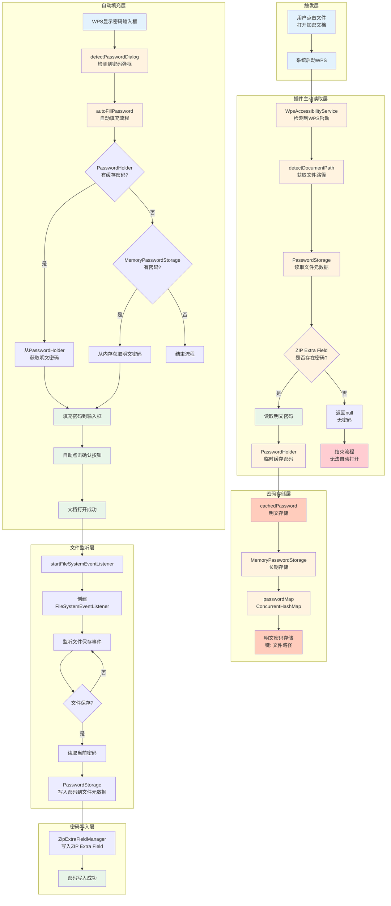

# 密码存储与文件打开功能流程图



## 插件主动读取密码流程详解

### 1. 文件路径获取
```kotlin
// WpsAccessibilityService.kt:661-850
detectDocumentPath(rootNode) {
    // 方法1: 从标题栏获取
    // 方法2: 从系统元素获取
    // 方法3: 从WPS特定界面获取
    // ...
    currentDocumentPath = detectedPath
}
```

### 2. 密码读取
```kotlin
// PasswordStorage.kt:28-50
fun getPassword(context: Context, key: String): String? {
    // 检查是否是content URI
    if (key.startsWith("content://")) {
        val uri = Uri.parse(key)
        return readPasswordFromContentUri(context, uri)
    } else {
        // 处理普通文件路径
        val file = File(key)
        return readPasswordFromFile(context, file)
    }
}
```

### 3. ZIP Extra Field读取
```kotlin
// PasswordStorage.kt:251-268
private fun readPasswordFromFile(context: Context, file: File): String? {
    // 从ZIP Extra Field读取密码
    val zipPassword = ZipExtraFieldManager.getInstance().readPassword(file)
    if (zipPassword != null) {
        return zipPassword  // 明文密码
    }
    return null
}
```

### 4. 密码缓存
```kotlin
// PasswordHolder.kt:14-18
fun storePassword(password: String, fileName: String) {
    cachedPassword = password  // 明文缓存
    targetFileName = fileName
}

// MemoryPasswordStorage.kt:32-43
fun storePasswordInMemory(key: String, password: String, fileUri: String? = null): Boolean {
    passwordMap[key] = password  // 明文存储到ConcurrentHashMap
    return true
}
```

## 密码存储对象详解

### 1. MemoryPasswordStorage（核心长期存储）
```kotlin
// 文件: MemoryPasswordStorage.kt:27
private val passwordMap = ConcurrentHashMap<String, String>()

// 存储方法: MemoryPasswordStorage.kt:32-43
fun storePasswordInMemory(key: String, password: String, fileUri: String? = null): Boolean {
    passwordMap[key] = password  // 明文存储
    Log.d(TAG, "密码已存储到内存: $key")
    return true
}

// 获取方法: MemoryPasswordStorage.kt:48-62
fun getPasswordFromMemory(key: String): String? {
    val password = passwordMap[key]  // 明文获取
    return password
}
```

### 2. PasswordHolder（临时缓存）
```kotlin
// 文件: PasswordHolder.kt:8-9
object PasswordHolder {
    var cachedPassword: String? = null    // 明文密码
    var targetFileName: String? = null    // 目标文件名
    
    // 存储方法: PasswordHolder.kt:14-18
    fun storePassword(password: String, fileName: String) {
        cachedPassword = password  // 明文存储
        targetFileName = fileName
    }
}
```

## 密码流转路径（插件主动读取模式）

```
用户点击文件打开WPS
    ↓
WpsAccessibilityService.detectDocumentPath() 获取文件路径
    ↓
PasswordStorage.getPassword() 读取文件元数据
    ↓
ZipExtraFieldManager.readPassword() 从ZIP Extra Field读取
    ↓
读取到明文密码
    ↓
存储到 PasswordHolder.cachedPassword (临时缓存)
    ↓
存储到 MemoryPasswordStorage.passwordMap (长期存储)
    ↓
WPS显示密码输入框
    ↓
WpsAccessibilityService.autoFillPassword()
    ↓
从PasswordHolder或MemoryPasswordStorage获取明文密码
    ↓
填充密码到输入框
    ↓
自动点击确认按钮
    ↓
文档打开成功
    ↓
启动 FileSystemEventListener 监听文件保存
    ↓
文件保存时写入密码到文件元数据
```

## 关键代码位置

| 功能 | 文件 | 行号 | 说明 |
|------|------|------|------|
| 文件路径检测 | WpsAccessibilityService.kt | 661-850 | detectDocumentPath方法 |
| 密码读取 | PasswordStorage.kt | 28-50 | getPassword方法 |
| ZIP读取 | PasswordStorage.kt | 251-268 | readPasswordFromFile方法 |
| 临时缓存 | PasswordHolder.kt | 8 | cachedPassword变量 |
| 临时缓存 | PasswordHolder.kt | 14-18 | storePassword方法 |
| 长期存储 | MemoryPasswordStorage.kt | 27 | ConcurrentHashMap定义 |
| 长期存储 | MemoryPasswordStorage.kt | 32-43 | storePasswordInMemory方法 |
| 自动填充 | WpsAccessibilityService.kt | 496-619 | autoFillPassword方法 |
| 文件监听 | WpsAccessibilityService.kt | 1359-1384 | startFileSystemEventListener方法 |

## 存储格式说明

### 明文存储位置
1. **MemoryPasswordStorage.passwordMap** - ConcurrentHashMap<String, String>
   - 键：文件路径（如 `/storage/emulated/0/Documents/test.docx`）
   - 值：明文密码（如 `"123456"`）

2. **PasswordHolder.cachedPassword** - String?
   - 临时缓存，用于快速访问
   - 明文存储

3. **ZIP Extra Field** - 文件元数据
   - 存储在docx/xlsx文件的ZIP格式中
   - 明文存储（无加密）

## 安全分析

### 存储格式
- **所有密码均以明文形式存储**
- 内存存储：ConcurrentHashMap、String变量
- 文件存储：ZIP Extra Field（明文）
- 无加密、无哈希、无编码转换

### 安全风险
1. **内存泄露风险**：密码长期保存在内存中
2. **日志暴露**：部分操作会记录密码到日志
3. **无访问控制**：任何组件都可以访问密码存储
4. **文件元数据暴露**：密码明文存储在文件元数据中

### 改进建议
1. 使用Android KeyStore加密存储密码
2. 及时清理内存中的密码
3. 避免在日志中记录密码
4. 对ZIP Extra Field中的密码进行加密
5. 添加访问控制和权限验证
